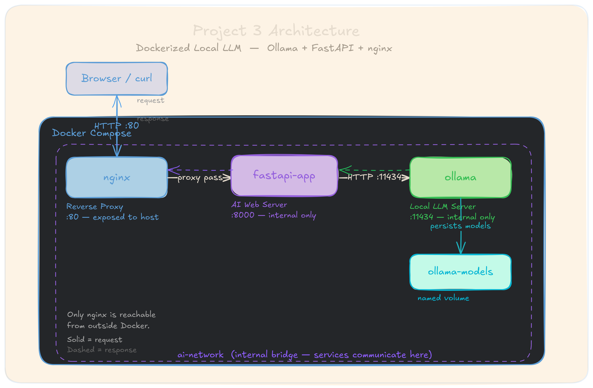

# Dockerized Local LLM with Ollama

A fully containerized AI stack where a local LLM runs entirely inside Docker —
no API keys, no external calls, no internet dependency after setup.
nginx routes traffic to a FastAPI backend, which talks to an Ollama container
running Llama 3.2.

---

## Architecture



```
Browser / curl
      │
      │ HTTP :80
      ▼
┌─────────────────────────────────────────────┐
│              Docker Compose                  │
│                                              │
│   ┌────────┐      ┌──────────────┐           │
│   │ nginx  │ ───▶ │ fastapi-app  │           │
│   │ :80    │      │   :8000      │           │
│   └────────┘      └──────┬───────┘           │
│                          │                   │
│                          ▼                   │
│                   ┌──────────────┐           │
│                   │   ollama     │           │
│                   │   :11434     │           │
│                   └──────────────┘           │
│                                              │
│   [ai-network — internal bridge]             │
└─────────────────────────────────────────────┘
```

- **nginx** — reverse proxy, the only service exposed to the host
- **fastapi-app** — Python backend, forwards questions to Ollama
- **ollama** — runs Llama 3.2 1B locally, no external API calls

---

## What It Does

- Accepts a plain English question and returns an AI-generated answer
- Runs entirely locally — zero API costs, zero API keys
- Fully containerized — one command brings up the whole stack
- nginx hides FastAPI and Ollama from direct external access
- Resource limits cap memory usage per container

---

## Demo

```bash
$ curl -X POST http://localhost:80/ask \
  -H "Content-Type: application/json" \
  -d '{"question": "What is container orchestration?"}'

{
  "question": "What is container orchestration?",
  "answer": "Container orchestration is the automated management of containerized
  applications, handling deployment, scaling, networking, and availability across
  a cluster of machines.",
  "model": "llama3.2:1b"
}
```

---

## Tech Stack

- Python 3 / FastAPI
- Ollama (Llama 3.2 1B)
- Docker / Docker Compose
- nginx (reverse proxy)
- httpx (async HTTP client)

---

## Setup

**1. Clone the repository**
```bash
git clone https://github.com/your-username/dockerized-ai-app.git
cd dockerized-ai-app
```

**2. Build and start the stack**
```bash
docker compose up --build
```

First run takes a few minutes — Ollama downloads the model into a persistent volume.

**3. Test it**
```bash
curl http://localhost:80/

curl -X POST http://localhost:80/ask \
  -H "Content-Type: application/json" \
  -d '{"question": "Explain Docker in one sentence"}'
```

---

## Project Structure

```
dockerized-ai-app/
├── app/
│   ├── main.py            # FastAPI application
│   ├── requirements.txt   # Python dependencies
│   └── entrypoint.sh      # Waits for Ollama before starting FastAPI
├── nginx/
│   └── nginx.conf         # Reverse proxy config
├── Dockerfile              # Builds the FastAPI image
├── docker-compose.yml      # Wires nginx + fastapi + ollama
├── .dockerignore
├── .gitignore
└── README.md
```

---

## Key Engineering Decisions

| Decision | Reason |
|---|---|
| Local LLM instead of cloud API | Zero cost, zero API key, works offline |
| nginx as the only exposed port | FastAPI and Ollama are never directly reachable from outside |
| Named volume for Ollama models | Models persist across container restarts — no re-downloading |
| Non-root user in FastAPI container | Limits blast radius if the app is ever compromised |
| Entrypoint script with retry loop | Handles Ollama's startup delay since the image has no built-in healthcheck tooling (no curl) |
| Memory limits on every service | Prevents one container from starving the others on shared hardware |

---

## Known Limitations

- Ollama's official image lacks `curl`/shell tooling, so Docker Compose healthchecks aren't reliable for it — startup readiness is instead handled inside `entrypoint.sh`
- Inference speed depends on host CPU — small models like `llama3.2:1b` are recommended for low-resource environments like GitHub Codespaces

---

## Author

**Victor** — DevOps Engineer  
[LinkedIn](https://www.linkedin.com/in/victor-adejuwon-67051b169/)